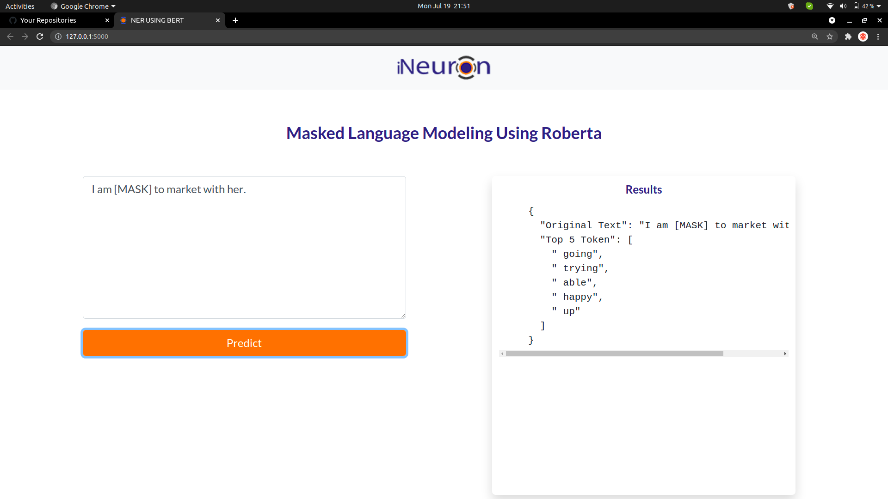
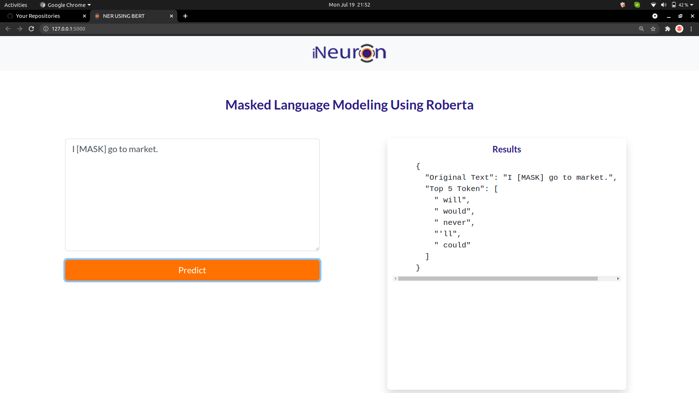
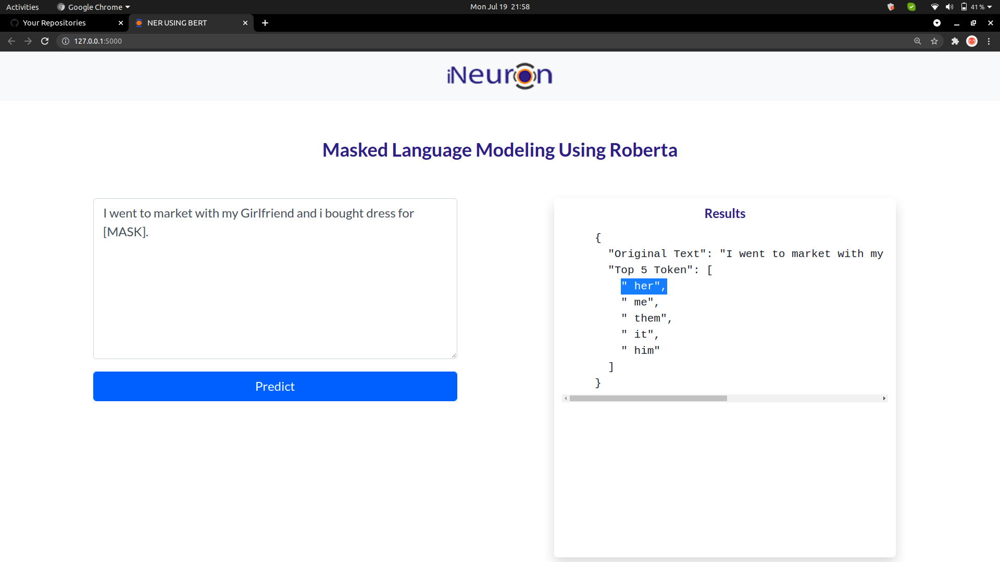

## Masked Language Modeling
It is also able to understand Grammer context.

### It is able to understand Corefference Resolution.
#### "Girlfriend" word represent again by "Her" word.

**RoBERTa: A Robustly Optimized BERT Pretraining Approach**
**Introduction of RoBERTa:** We find that BERT was significantly undertrained and propose an improved recipe for training BERT models, which we call RoBERTa, that can match or exceed the performance of all of the post-BERT methods. Our modifications are simple, they include:
    1. training the model longer, with bigger batches, over more data
    2. removing the next sentence prediction objective
    3. Training on longer sequences; and
    4. dynamically changing the masking pattern applied to the training data.

**DataCollection:** we have collected the data from WikiText dataset which is having the text of Wikipedia & approx 1M records.
Data Preparation: 
    1. we have take the text data & try to tokenize the all the sequences without padding & truncatation.
    2. Then we are try to merge all the input_ids & attention_mask in list for randomly masking the some of the tokens with the MaskTokenID.
    3. Then we are also taking the same data from inputID for labels & try to predict only masked token not all the token.
       
**Model Building:** Then here we are trying to Build the model in Pytorch Framwork so that we can do Dynamic Quantization very easily.
    • We have trained the data upto 25 epochs & then got validation loss less thn = 0.085

**Dynamic Quantization:** we have got the Model 1.2GB so for fast inferencing we have performed the Model Quantization on Dense Layers from Float 32 to qint8.

**Prediction:** So for prediction we have used [MASK] string by which we trying to convert it into maskToken for feed to the model. & our Finetuned model able to undersand Grammer Context & correfference Resolution.

